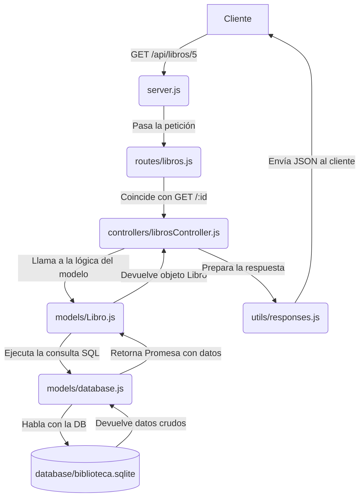

# Explicación Detallada: Anatomía de una API REST con Express y SQL

## 🎯 Objetivo de este Documento

Este documento desglosa la arquitectura del proyecto de la API de la biblioteca. El objetivo es que entiendas el **flujo de una petición** desde que llega al servidor hasta que se devuelve una respuesta, y el **rol específico** que juega cada archivo y directorio en este proceso profesional.

---

## 1. El Flujo de una Petición: Un Viaje a Través de la API

Cuando un cliente (como una aplicación de React o Postman) hace una petición a `GET /api/libros/5`, no es un solo archivo el que responde. La petición emprende un viaje organizado a través de varias capas:



**El Viaje Explicado:**
1.  **`server.js` (El Recepcionista)**: Es la puerta de entrada. Aplica middlewares globales como seguridad (`helmet`), logging y rate limiting. Su trabajo principal es dirigir el tráfico a la ruta correcta.
2.  **`routes/libros.js` (El Directorio de Rutas)**: Es como un panel de señalización. Mira la petición y dice: "Ah, es un `GET` a `/libros/:id`, esto le corresponde al `librosController.obtenerLibro`".
3.  **`controllers/librosController.js` (El Gerente de Lógica)**: Aquí vive la lógica de negocio. Recibe la petición, entiende lo que se necesita (obtener un libro por ID), llama al modelo para obtener los datos y, una vez que los tiene, decide qué respuesta enviar.
4.  **`models/Libro.js` (El Experto en Datos)**: Este archivo sabe todo sobre los libros. Contiene la lógica para interactuar directamente con la base de datos para la entidad `Libro`. Traduce la petición del controlador ("dame el libro 5") en una consulta SQL.
5.  **`models/database.js` (El Conector Universal)**: Es el único archivo que habla directamente con el driver de `sqlite3`. Proporciona métodos genéricos (`get`, `all`, `run`) para que los modelos no tengan que preocuparse por los detalles de la conexión. Es un singleton, asegurando una única conexión a la DB.
6.  **`utils/responses.js` (El Formateador de Respuestas)**: Un helper para estandarizar las respuestas JSON, asegurando que todos los éxitos y errores tengan el mismo formato.

---

## 2. El Patrón de Diseño: Modelo-Vista-Controlador (MVC)

Esta estructura no es aleatoria. Sigue un patrón de diseño de software muy popular llamado **MVC** (o una variación del mismo para APIs).

*   **Modelo (Model)**: `src/models/`
    *   **Responsabilidad**: Gestionar los datos y la lógica de negocio relacionada con ellos. Es la única capa que habla con la base de datos. No sabe nada sobre peticiones HTTP o respuestas JSON.
    *   *Ejemplo*: `Libro.js`

*   **Vista (View)**: En una API REST, la "vista" es la representación de los datos que se envía al cliente, generalmente en formato **JSON**.

*   **Controlador (Controller)**: `src/controllers/`
    *   **Responsabilidad**: Actuar como intermediario entre el Modelo y la Vista. Recibe la petición del usuario (a través de la ruta), le pide al Modelo los datos que necesita y luego le pasa esos datos a la Vista (en nuestro caso, la respuesta JSON).
    *   *Ejemplo*: `librosController.js`

**¿Por qué usar este patrón?**
Por la **Separación de Responsabilidades**. Si quisieras cambiar la base de datos de SQLite a PostgreSQL, solo tendrías que modificar la capa del Modelo. El Controlador y las Rutas no se verían afectados. Si quisieras cambiar la estructura de tus respuestas JSON, solo tocarías el Controlador. Esto hace que el código sea más fácil de mantener, testear y escalar.

---

## 3. El Desafío de la Asincronía: Promesas y `async/await`

Las operaciones de base de datos son operaciones de **Entrada/Salida (I/O)**. Pueden tardar unos milisegundos. En un servidor que maneja cientos de peticiones por segundo, no podemos permitirnos "bloquear" todo el programa esperando que una consulta termine.

El driver original de `sqlite3` usa **callbacks**: le pasas una función que se ejecutará *cuando* la consulta termine.

**Callback Hell (❌ Mal):**
```javascript
db.get('SELECT ...', (err, data) => {
    if (err) { /* maneja error */ }
    // ...hacer algo con data
});
```

El archivo `database.js` hace algo muy inteligente: "envuelve" estas funciones basadas en callbacks dentro de **Promesas (Promises)**.

```javascript
// En database.js
get(sql, params = []) {
    return new Promise((resolve, reject) => { // Devuelve una Promesa
        this.db.get(sql, params, (err, row) => {
            if (err) reject(err); // Si hay error, la promesa se rechaza
            else resolve(row);    // Si hay éxito, la promesa se resuelve con los datos
        });
    });
}
```

Al hacer esto, ahora podemos usar la sintaxis limpia de `async/await` en nuestros modelos y controladores, que es mucho más fácil de leer y razonar.

**`async/await` (✅ Bien):**
```javascript
// En Libro.js
static async findById(id) {
    // 'await' pausa la ejecución de ESTA función hasta que la Promesa se resuelva
    const libro = await database.get('SELECT ...', [id]);
    return libro;
}
```

---

## 4. El Rol del Middleware: Los Puestos de Control de Express

Un middleware es simplemente una función que se ejecuta **entre** la petición y la respuesta final. Son como los puestos de control en una carretera.

`Petición -> Middleware 1 -> Middleware 2 -> Controlador Final -> Respuesta`

En nuestro proyecto, se usan para:

*   **`validation.js`**: Verifica que los datos que llegan en el `req.body` de un `POST` o `PUT` tengan el formato correcto **antes** de que lleguen al controlador. Si la validación falla, detiene el viaje y devuelve un error 400.
*   **`errorHandler.js`**: Es el último puesto de control. Si cualquier middleware o controlador anterior lanza un error (llamando a `next(error)`), este middleware lo atrapa y se asegura de enviar una respuesta de error 500 con un formato consistente, evitando que el servidor se caiga.
*   **Otros (`cors`, `helmet`, `rateLimit`)**: Son middlewares de terceros que se encargan de tareas comunes como la seguridad y la protección contra ataques de fuerza bruta.

Usar middlewares mantiene los controladores limpios y centrados en su lógica de negocio, delegando tareas repetitivas a estos puestos de control especializados.
