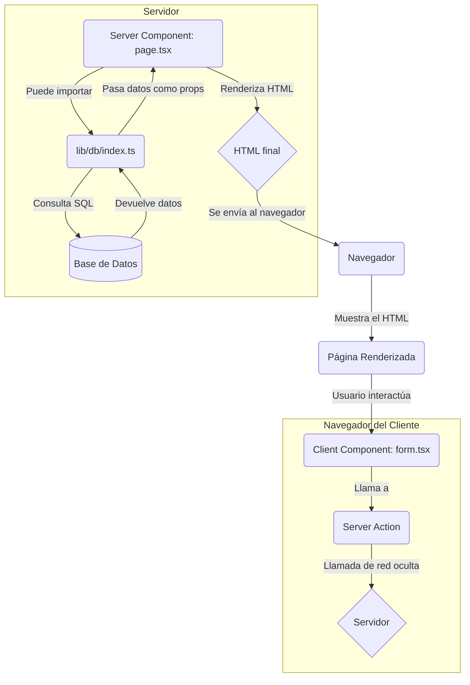

# Explicación Detallada: El Paradigma de Next.js Full-Stack

## 🎯 Objetivo de este Documento

Este documento desglosa los conceptos revolucionarios que introduce Next.js 14: Server Components y Server Actions. El objetivo es que entiendas la **filosofía** detrás de este nuevo modelo, por qué es tan potente y cómo cambia la forma en que interactuamos con las bases de datos.

---

## 1. Server Components vs. Client Components: Los Dos Cerebros de tu App

La idea más importante a entender es que en Next.js 14, tus componentes pueden ejecutarse en dos lugares completamente diferentes: el servidor o el navegador del cliente. Por defecto, **todos los componentes son Server Components**.

| Característica | ✅ Server Component (Servidor) | 🔵 Client Component (Cliente) |
|---|---|---|
| **Ubicación** | Se renderiza **solo en el servidor**. | Se renderiza en el servidor y luego se "hidrata" para ser interactivo en el navegador. |
| **Acceso a Datos** | **Puede acceder directamente a la base de datos**, usar variables de entorno, etc. | **NO PUEDE** acceder a la base de datos directamente. Debe usar `fetch` a una API o Server Actions. |
| **Interactividad** | No puede usar hooks como `useState` o `useEffect`. Es para mostrar datos. | **Puede usar `useState`, `useEffect`, `onClick`**. Es para la interactividad del usuario. |
| **Marcador** | Es el comportamiento por defecto. | Debe tener la directiva **`"use client";`** al principio del archivo. |

**Diagrama de Flujo Mental:**



### El "Componente Full-Stack"

Un Server Component es un concepto revolucionario porque es un **componente full-stack**. En un solo archivo, podés:
1.  Escribir una consulta a la base de datos (`async/await`).
2.  Renderizar el HTML con esos datos.

Todo esto ocurre de forma segura en el servidor. El cliente solo recibe el HTML final, sin las credenciales de la base de datos ni el código de la consulta.

---

## 2. Server Actions: La Magia de las Mutaciones sin API

Si los Server Components son para leer datos, los **Server Actions** son para escribirlos (`INSERT`, `UPDATE`, `DELETE`).

**¿Qué es una Server Action?**
Es una función asíncrona que escribís en tu código (generalmente en un archivo `actions.ts`) y que marcás con la directiva **`"use server";`**. 

**La Magia:**
Cuando "llamas" a esta función desde un formulario o un botón en un Client Component, Next.js hace algo increíble:
1.  Crea automáticamente un **endpoint de API privado y oculto** para esa función.
2.  Cuando el usuario hace clic en el botón, el frontend hace una llamada `fetch` a ese endpoint oculto, pasándole los argumentos de la función.
3.  La función se ejecuta de forma segura **en el servidor**, realiza la operación en la base de datos y puede devolver un resultado.

Esto elimina la necesidad de crear manualmente rutas de API en Express (`app.post('/api/...')`) para cada operación. El código se vuelve más simple y cohesivo.

```typescript
// lib/actions/generos.ts
"use server"; // ¡La directiva mágica!

import { db } from "@/lib/db";
import { generos } from "@/lib/db/schema";

export async function agregarGenero(nombre: string) {
  if (!nombre) return { error: "El nombre es requerido" };

  try {
    const nuevoGenero = await db.insert(generos).values({ nombre }).returning();
    return { data: nuevoGenero[0] };
  } catch (error) {
    return { error: "El género ya existe" };
  }
}
```

---

## 3. Caching y Revalidación: Manteniendo los Datos Frescos

Next.js es muy agresivo con el cacheo para que las aplicaciones sean ultrarrápidas. Cuando un Server Component obtiene datos, Next.js "toma una foto" (hace un caché) del HTML resultante.

**El Problema**: Si agregas un nuevo libro con una Server Action, ¿cómo le decís a Next.js que la "foto" de la página de libros está desactualizada y que necesita tomar una nueva?

**La Solución**: `revalidatePath()`.

`revalidatePath` es una función que se llama dentro de una Server Action después de una mutación exitosa. 

```typescript
// ...dentro de una Server Action

await db.insert(libros).values(nuevoLibro);

// ¡La parte clave!
revalidatePath('/libros'); // Invalida el caché de la página de libros
redirect('/libros'); // Opcional: redirige al usuario
```

Al llamar a `revalidatePath('/libros')`, le estás diciendo a Next.js: "La próxima vez que alguien visite la página `/libros`, no le muestres la foto vieja. Volvé a ejecutar el Server Component, hacé la consulta a la base de datos de nuevo y generá un HTML fresco".

Esto te da lo mejor de dos mundos: el rendimiento del cacheo estático y la dinámica de los datos en tiempo real.
